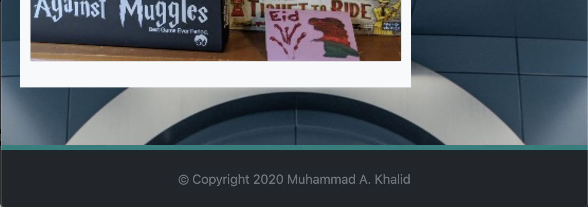
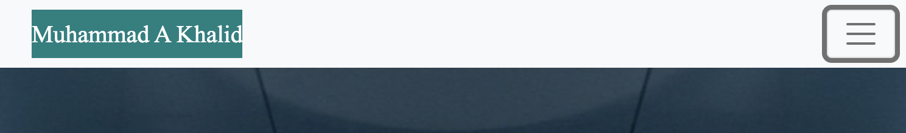
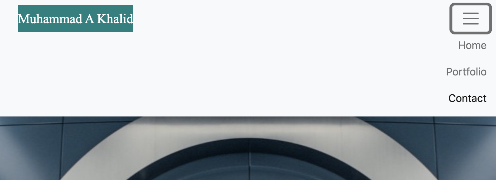

# My Portfolio
This is my portfolio, there are many like it but this one is mine.

## Description 
Given an existing image of a portfolio website, my task was to imitate the image and create a responsive portfolio using Bootstrap. This site contains an About Me page, a Portfolio page showcasing some of my interests and a Contact page should a user wish to communicate with me.

-----------------------
## Site Picture


-----------------------
## Code Snippets

### Media Query code
THe media query is used for screens 400px in width or smaller and it gives the wrapper class a padding of 0px and  a margin of 50px on the right. 
```
@media screen and (max-width: 400px) {
  .wrapper {
    padding-right: 0px;
    margin-right: 50px;
  }
}
```


### Footer code
The footer (as seen below) uses a Bootstrap container-fluid and col-12 in conjection with a fixed-bottom class in the footer element to have the footer take up the width of the screen and stay glued to the bottom of the window. 

```
<div class="container-fluid col-12">
  <footer class="row fixed-bottom bg-dark">
    <div class="text-muted my-4">
      &copy; Copyright 2020 Muhammad A. Khalid
    </div>
  </footer>
</div>
```



### Navbar code
The following code gives the navbar a hamburger button on mobile screens through the 'button' elemtn and the class 'navbar-toggler-icon'. I then used 'justify-content-end' on unordered list element to position the list items to the right. The 'active ' clas is used to indicate which page the user is currently on. 

```
<button class="navbar-toggler" type="button" data-bs-toggle="collapse" data-bs-target="#navbarNav" aria-controls="navbarNav" aria-expanded="false" aria-label="Toggle navigation">
  <span class="navbar-toggler-icon"></span>
</button>
<div class="collapse navbar-collapse justify-content-end" id="navbarNav">
  <ul class="navbar-nav align-items-end me-1">
    <li class="nav-item">
      <a class="nav-link" href="index.html">Home</a>
    </li>
    <li class="nav-item">
      <a class="nav-link active" aria-current="page" href="portfolio.html">Portfolio</a>
    </li>
    <li class="nav-item">
      <a class="nav-link" href="contact.html">Contact</a>
    </li>
  </ul>
</div>
```
Here you can see a comparison of the navbar in its default collapsed form and its expanded form when clicking on the hamburger button.



-----------------------
## Prerequisites
A computer with an active internet connection

-----------------------
## Installing instructions
None

-----------------------
## Built with
- [Bootstrap 5.0](https://getbootstrap.com/)
- HTML
- CSS
- Git
- Github

-----------------------
## Deployed Link
https://akhalid88.github.io/responsive-portfolio-example/

-----------------------
## Licenses
This project is licensed under MIT license.

Bootstrap is licensed under the MIT license and is copyright 2020 Twitter

-----------------------
## Author: Muhammad A Khalid

[LinkedIn](https://www.linkedin.com/in/abdullahkhalid/)
<br>
[GitHub](https://github.com/akhalid88)

-----------------------
## Acknowledgements
- Jerome Chenette (Instructor)
- Manuel Nunes (TA)
- Mahisha Manikandan (TA)
- UC Berkeley Coding Bootcamp