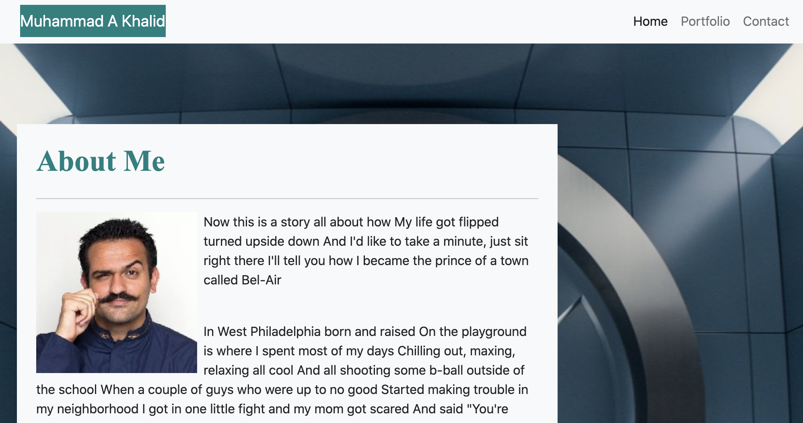

# My Portfolio
This is my portfolio, there are many like it but this one is mine.

## Description 
Given an existing image of a portfolio website, my task was to imitate the image and create a responsive portfolio using Bootstrap. This site contains an About Me page, a Portfolio page showcasing some of my interests and a Contact page should a user wish to communicate with me.

-----------------------
## Site Picture

-----------------------
## Code Snippets

-----------------------
## Prerequisites
A computer with an active internet connection

-----------------------
## Installing instructions
None

-----------------------
## Built with
- Bootstrap
- HTML
- CSS
- Git
- Github

-----------------------
## Deployed Link
https://akhalid88.github.io/responsive-portfolio-example/

-----------------------
## Licenses
This Project is licensed under MIT license

-----------------------
## Author: Muhammad A Khalid

[LinkedIn](https://www.linkedin.com/in/abdullahkhalid/)
 
[GitHub](https://github.com/akhalid88)

-----------------------
## Acknowledgements
- Jerome Chenette (Instructor)
- Manuel Nunes (TA)
- Mahisha Manikandan (TA)
- UC Berkeley Coding Bootcamp